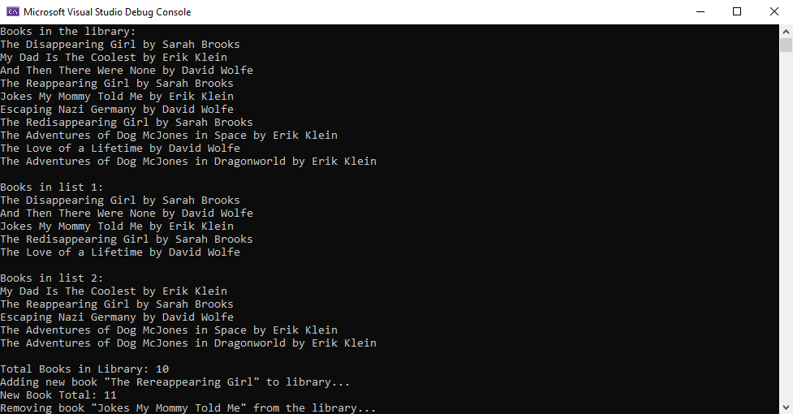

# Lab07-LendingLibrary
**Author**: Benjamin Taylor  
**Version**: 1.0.0

## Overview
A C# command line application that simulates a library.

## Getting Started
1. Create a fork of this repository, and clone your fork to your device.
2. Open the solution file `LendingLibrary.sln` in Visual Studio.
3. To run the app, go to `Debug` > `Start Without Debugging` (or press Ctrl+f5).
4. For testing, navigate to the `LibraryTests` project using the Solution Explorer.
5. To run the tests, go to `Tests` > `Run` > `All Tests` (or press Ctrl+R)

## Using The Application

1. Upon starting the application, a bunch of information will be displayed to the console. Use the scroll bar to view the information.

## Architecture
**Languages Used**:
* C# 7.3 (.NET Core 2.2)

Written with Visual Studio Community 2019.

## Change Log
- 07-04-2019 - 20:52PM: Initial Version